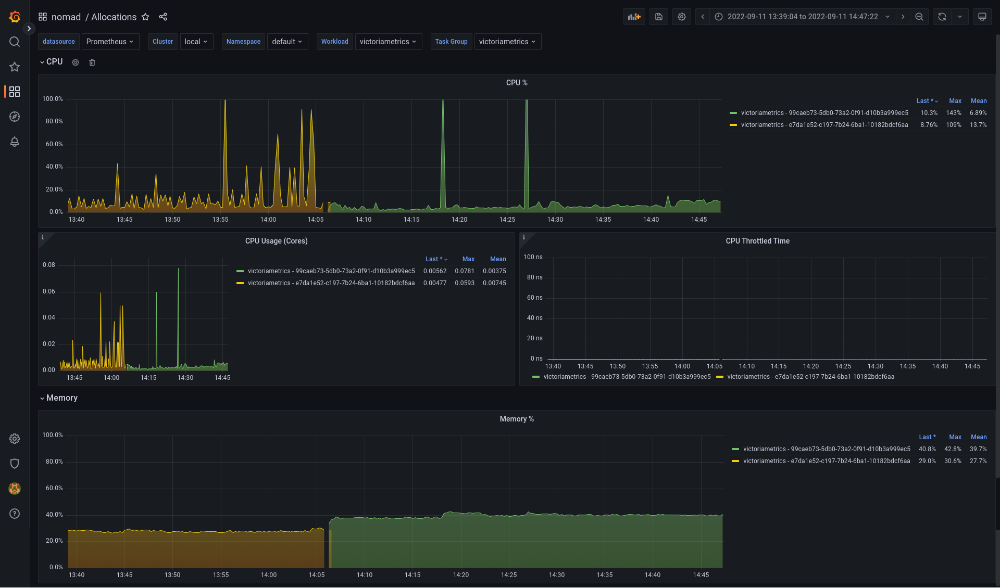
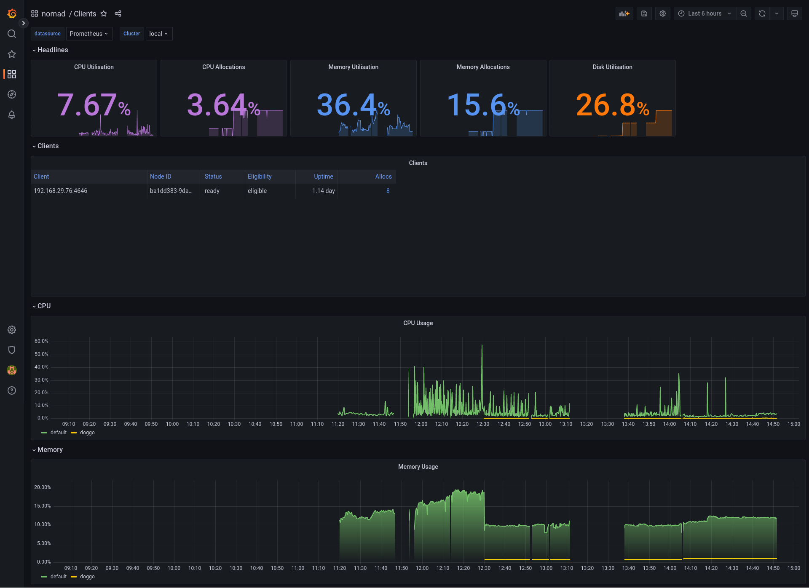
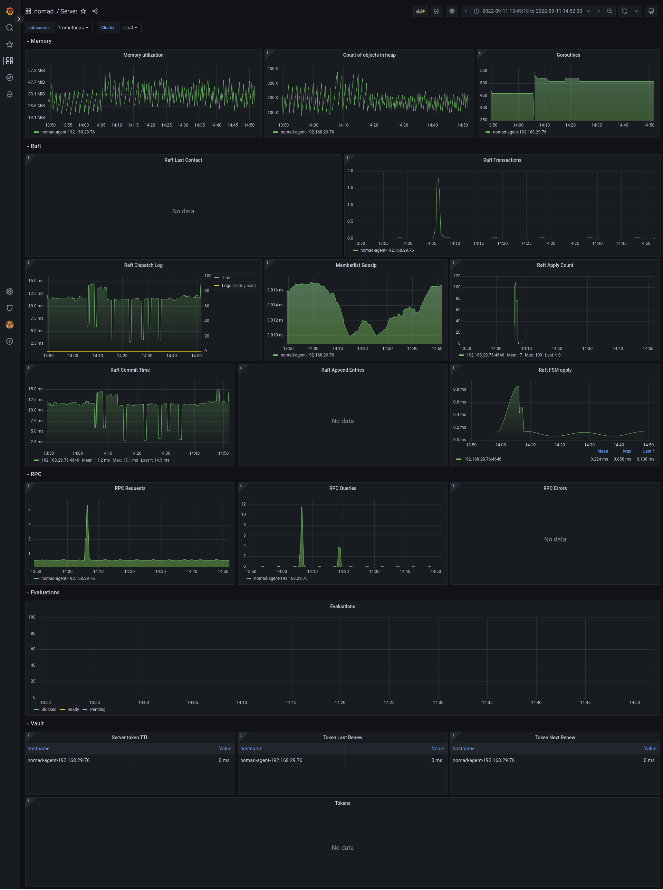

<a href="https://zerodha.tech"></a>

# Nomad Monitoring

A collection of [Nomad](https://www.nomadproject.io/) jobspecs and [Grafana](https://grafana.com/) dashboards to provide complete monitoring of Nomad clusters.

## Dashboards

- [Server](https://grafana.com/grafana/dashboards/16924-server/): Monitor overall health and resource usage of a Nomad cluster, Raft usage, RPC usage etc.
- [Client](https://grafana.com/grafana/dashboards/16923-clients/): Monitor resource usage of Nomad clients.
- [Allocations](https://grafana.com/grafana/dashboards/16925-allocations): Monitor resource metrics like CPU, Memory and Disk for each allocation across namespaces.





## Collecting Metrics

Nomad comes with an in-built publication of [metrics](https://www.nomadproject.io/docs/operations/monitoring-nomad), which makes it easier to collect metrics without running any 3-rd party tool. To enable Prometheus metrics, configure the [`telemetry`](https://www.nomadproject.io/docs/configuration/telemetry) stanza in each Nomad agent:

```hcl
telemetry {
  collection_interval        = "15s"
  disable_hostname           = true
  prometheus_metrics         = true
  publish_allocation_metrics = true
  publish_node_metrics       = true
}
```

This repository demonstrates the usage of [`vmagent`](https://github.com/VictoriaMetrics/VictoriaMetrics/blob/master/docs/vmagent.md), which is a lightweight metrics collection agent. Prometheus also [ships with an agent-only mode](https://prometheus.io/blog/2021/11/16/agent/), which can be used alternatively. I find `vmagent` to have a better UX for config (more straightforward relabelling rules, splitting of `scrape_configs` as multiple files). Its lightweight resource usage makes it my de-facto choice for collecting Prometheus metrics.

## Storing Metrics

Victoriametrics is used as a TSDB to store metrics. Victoriametrics can support large number of active time series in memory and is efficient at storing large batches of time series on disk. `vmagent` is configured to use `remote_write` protocol and send the metrics collected to Victoriametrics. The retention period can be configured on Victoriametrics' end.

## Notes

### Nomad Services

Since Nomad 1.3, `nomad` comes with its own service discovery mechanism. It allows for service discovery within the namespaces by templating a file. However, as of now, it cannot discover services outside a particular namespace, making it hard to deploy a central `vmagent`. Until Nomad services come with that feature, the two choices that exist right now:

- Use `consul` for service discovery and use `consul_sd_config` in `vmagent` to discover.
- Deploy `vmagent` for each namespace and discover services via Nomad service discovery. Use them with `static_config`.

## Running locally

To run a local Nomad agent (running as a server and client), run the following:

```bash
make run-nomad
```

To deploy Grafana, [Victoriametrics](https://victoriametrics.com/) and `vmagent`, run:

```bash
make deploy
```

## TODO

- [ ] Add alert rules
